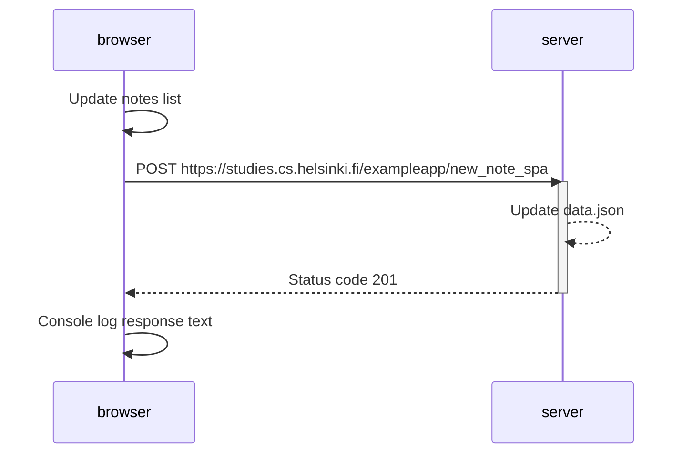

Below you can find a sequence diagram depicting the interaction between the user's browser and the example app web server when the user creates new notes using the form at: https://studies.cs.helsinki.fi/exampleapp/spa

